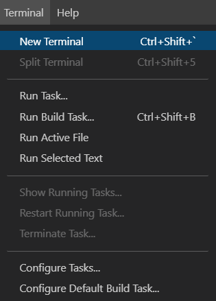
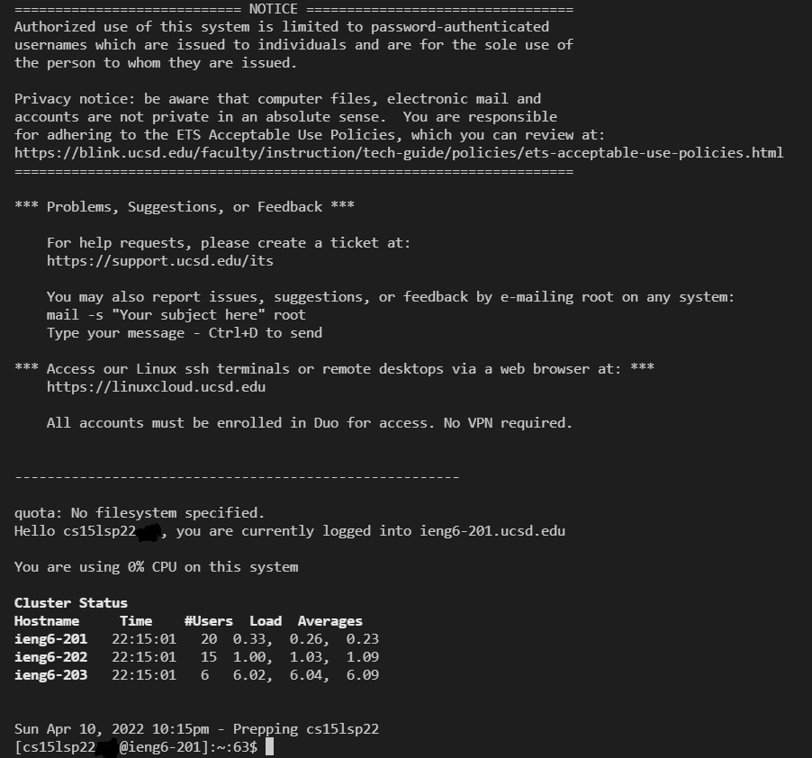
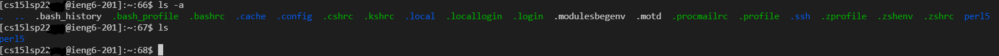

# **Getting Started in CSE15L**
## Overview
---
Hello student! This is a guide on how to prepare your computer for this course. You will be installing VScode, logging in with your unique ieng6 id for remote access, and practicing transferring files. The following is the list of instructions you will be going through. You got this!
- Installing VScode
- Remotely Connecting
- Trying Some Commands
- Moving Files with scp
- Setting an SSH Key
- Optimizing Remote Running 

 

--- 
## **Installing VScode**
---

 

### __1.__  Go to [code.visualstudio.com](code.visualstudio.com) and follow the instructions to download and install VScode to your system

### __2.__ This is what it should somewhat look like once you launch it(color & layout will differ depending on how you set it up):

 
 

---
## **Remotely Connecting**
---
 

### __1.__ Before moving on, you must install OpenSSH in order to connect to the remote computer to do your work on there. Follow the instructions to install OpenSSH through this [microsoft link](https://docs.microsoft.com/en-us/windows-server/administration/openssh/openssh_install_firstuse) depending on your operating system.

### __2.__ Next, you need to find your course-specific account through the [account lookup on UCSD](https://sdacs.ucsd.edu/~icc/index.php)
* Input your student **username**(the portion before your @ucsd.edu email) and your Student ID and press submit
* This is what you should see when you press submit, look for the circled area, that is your __*ieng6*__ username

     ***Keep in mind it is a lowercase 'L' after the 15, and you might have different letters and numbers following that 'L'.** (sp22 for spring 22, and you will have your own unique combination at the end
 
 ### __3.__ You are now ready to connect to the remote server
*(I will be referencing [this](https://code.visualstudio.com/docs/remote/ssh#_connect-to-a-remote-host) for these next few steps)*
 
 * On VScode, you can open the terminal by pressing *Ctrl + `* or from the top bar *Terminal → New Terminal*
 
 * Once the terminal is open, you can begin by typing:

        ssh cs15lsp22zzz@ieng6.ucsd.edu
    *Remember to replace the 'sp22zzz' with your specific account(see previous step)*
* You will probably see this for your first time connecting:

        ssh cs15lsp22zz@ieng6.ucsd.edu
        The authenticity of host 'ieng6.ucsd.edu (128.54.70.227)' can't be established.
        RSA key fingerprint is SHA256:ksruYwhnYH+sySHnHAtLUHngrPEyZTDl/1x99wUQcec.
        Are you sure you want to continue connecting (yes/no/[fingerprint])?
* Just type yes and continue along, then enter your password, it should look like this once you're in:

 

You are now logged in and connected to the remote server, **Congrats!** Any commands you run from this terminal will run on the computer you're connected to.

 
 

---
## **Trying Some Commands**
---

 

Now that you're connected, you can start testing commands. Some you can try are:

    cd ~
    cd
    ls -a
    ls -lat
    cp /home/linux/ieng6/cs15lsp22/public/test.txt ~/
    cat /home/linux/ieng6/cs15lsp22/public/test.txt

This is what running some commands looks like:

You can also open a new terminal and test some of these commands on your local computer  to see the difference.

If you wanted to logout of the server you can always press ***Ctrl + D*** or run the command ***exit*** in the ssh terminal

 
 

---
## **Moving files over with scp**
---

 

Now we're going to learn how to move files remotely from the terminal. As coders, moving files between computers is important and being able to do work remotely helps a lot. You might be familiar with transferring files through e-mail, Google Drive, or Dropbox, then accessing those on the receiving end to download the files.

You won't need to do any of those with what I am about to teach you in the following steps. We will be utilizing the *scp* command from your client(local computer) in order to transfer files to the remote server.

1. Create a new file 

