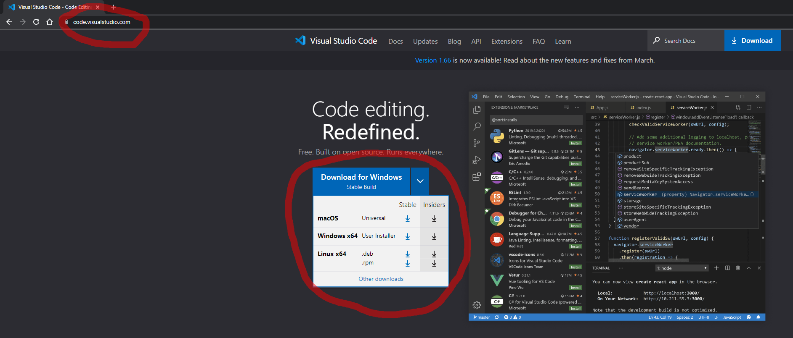
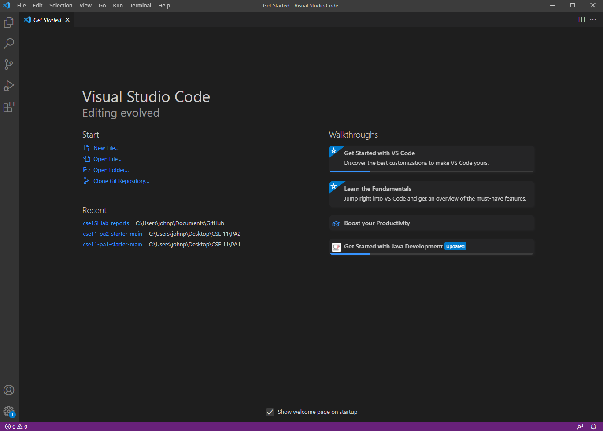
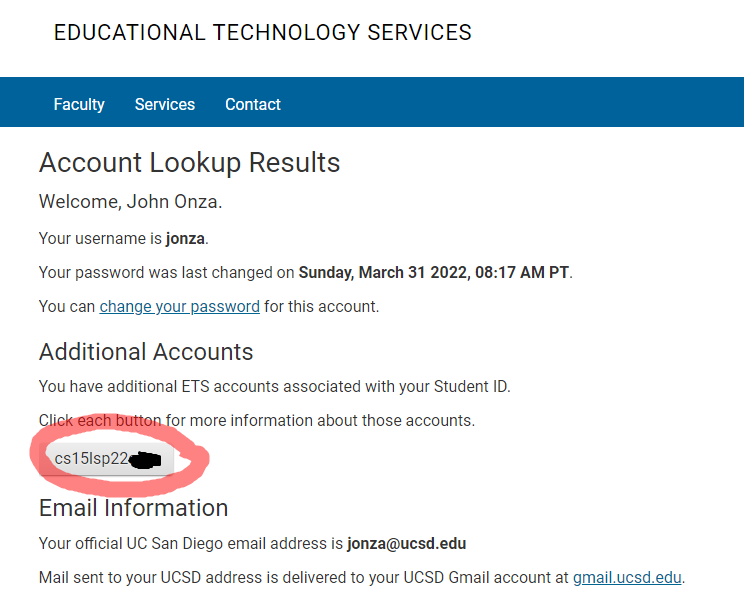

# **Getting Started in CSE15L**
## Overview
---
Hello student! This is a guide on how to prepare your computer for this course. You will be installing VScode, logging in using remote access, and practicing transferring files. The following is the specific list of instructions you will be going through. You got this!
- Installing VScode
- Remotely Connecting
- Trying Some Commands
- Moving Files with scp
- Setting an SSH Key
- Optimizing Remote Running 

--- 
## **Installing VScode**
---

### __1.__  Go to [code.visualstudio.com](code.visualstudio.com) and follow the instructions to download and install VScode to your system

### __2.__ This is what it should somewhat look like once you launch it(color & layout will differ depending on how you set it up):

---
## **Remotely Connecting**
---
### __1.__ Before moving on, you must install OpenSSH in order to connect to the remote computer to do your work on there. Follow the instructions to install OpenSSH through this [microsoft link](https://docs.microsoft.com/en-us/windows-server/administration/openssh/openssh_install_firstuse) depending on your operating system.

### __2.__ Next, you need to find your course-specific account through the [account lookup on UCSD](https://sdacs.ucsd.edu/~icc/index.php)
* Input your student **username**(the portion before your @ucsd.edu email) and your Student ID and press submit
* This is what you should see when you press submit, look for the circled area, that is your __*ieng6*__ username

 ***Keep in mind it is a lowercase 'L' after the 15, and you might have different letters and numbers following that 'L'.** (sp22 for spring 22, and you will have your own unique combination at the end