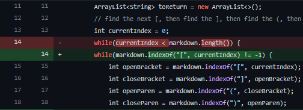
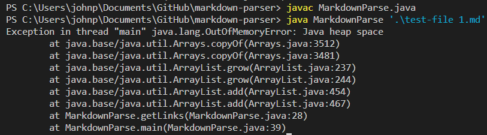
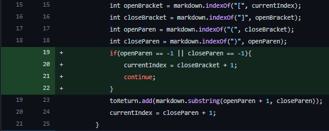
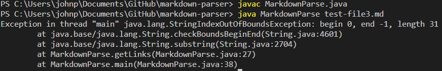
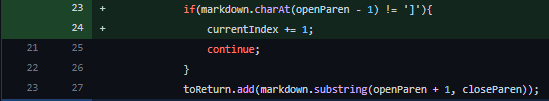
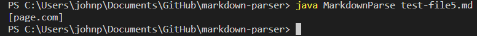

# Lab Report 2 Week 4
 
---
## **Code Change #1:**
---

[Link to file-inducing test](https://github.com/johnpaulonza/markdown-parser/blob/main/test-file%201.md?plain=1)

**Error Output:**

The bug is that the way the code was given, the while loop condition is always true, causing an infinite loop. currentIndex will always be less than markdown.length because it was returning zero. So the symptom is that there is no output for a while, until we get an OutOfMemoryError. 

---
## **Code Change #2:**
---

[Link to file-inducing test 3](https://github.com/johnpaulonza/markdown-parser/blob/main/test-file3.md)

**Error Output:**

The bug was that there was that if there was no ")" anywhere in the file, closeParen would equal -1, then at the end of the code it would try to run substring with the second index being -1, which shows the StringIndexOutOfBoundsException. The file inducing input did not have any ")", therefore causing the error.

---
## **Code Change #3:**
---

[Link to file-inducing test 3](https://github.com/johnpaulonza/markdown-parser/blob/main/test-file5.md)

**Error Output:**

The bug is that any set of parentheses will have their contents added to the list of links, even though it was not in the right format of "[name] (name.com)" without the space in between. So the contents of any set of parentheses will be added to the list. The test file had "(page.com)" by itself on a line, and it was added to the list of links as you can see. 